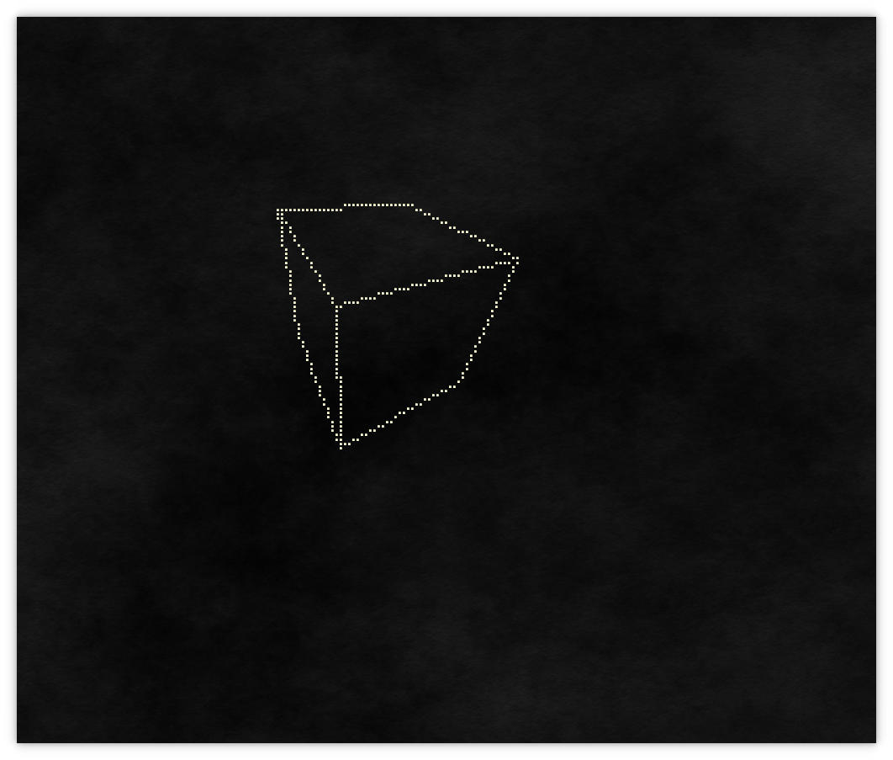
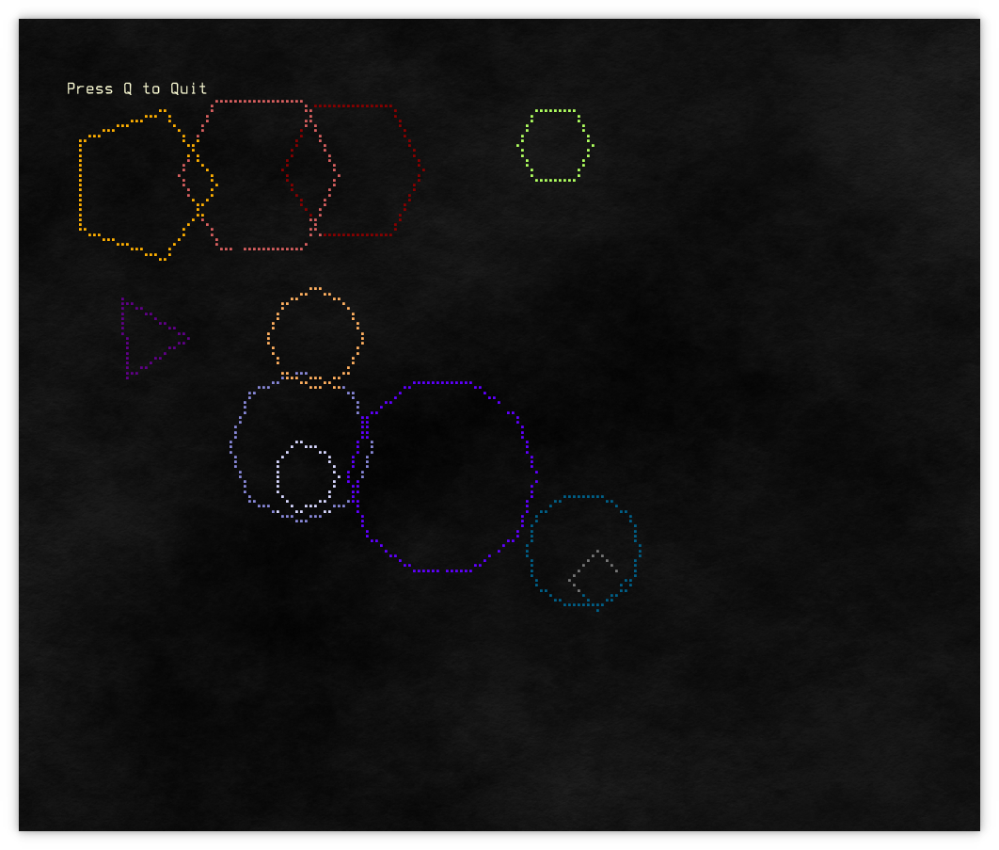
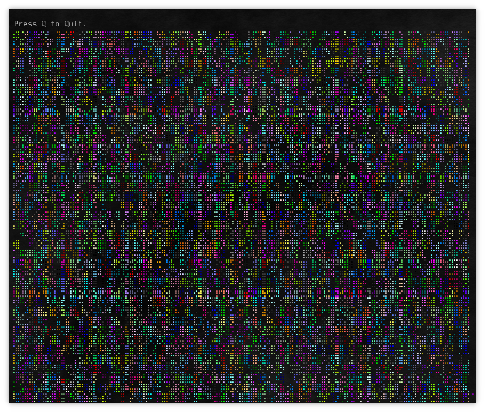
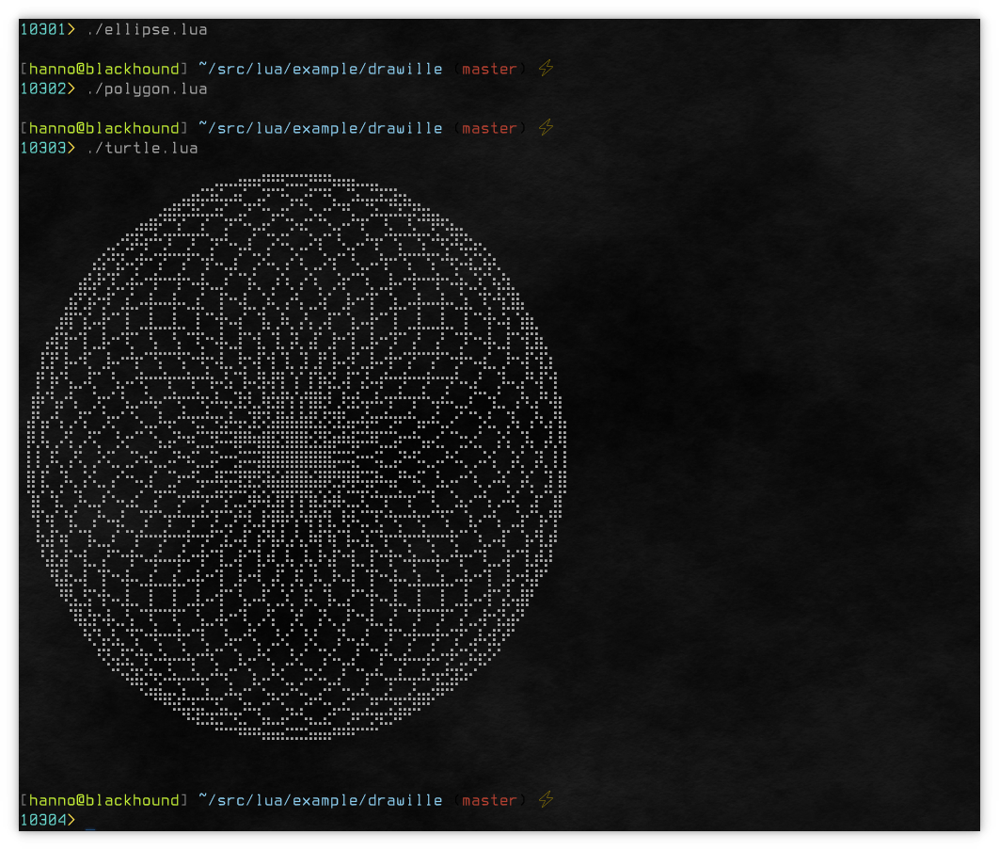
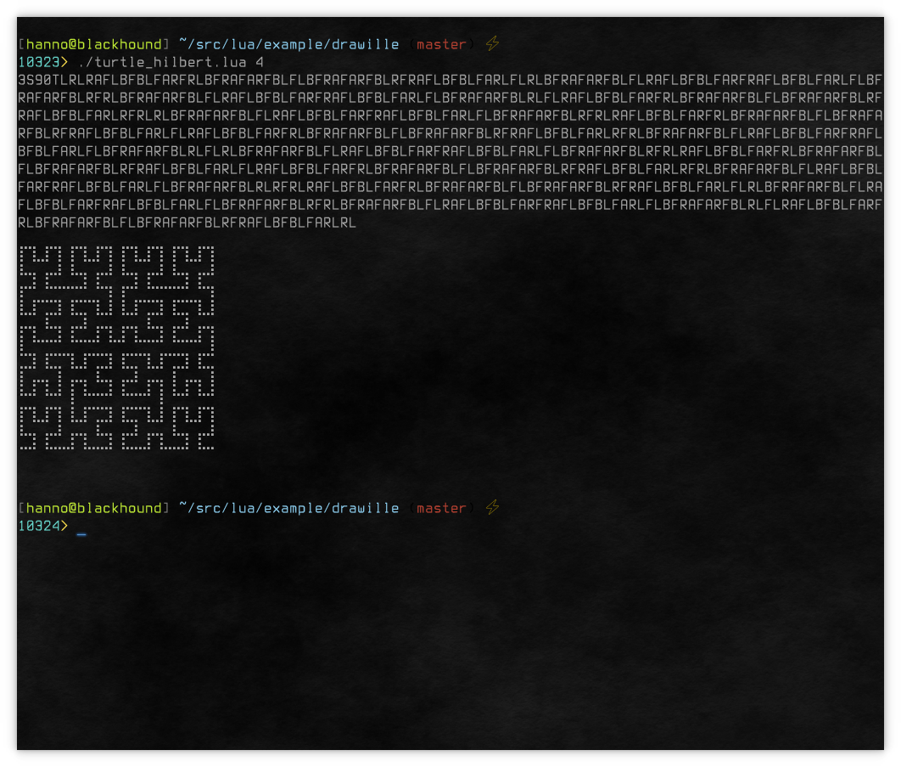
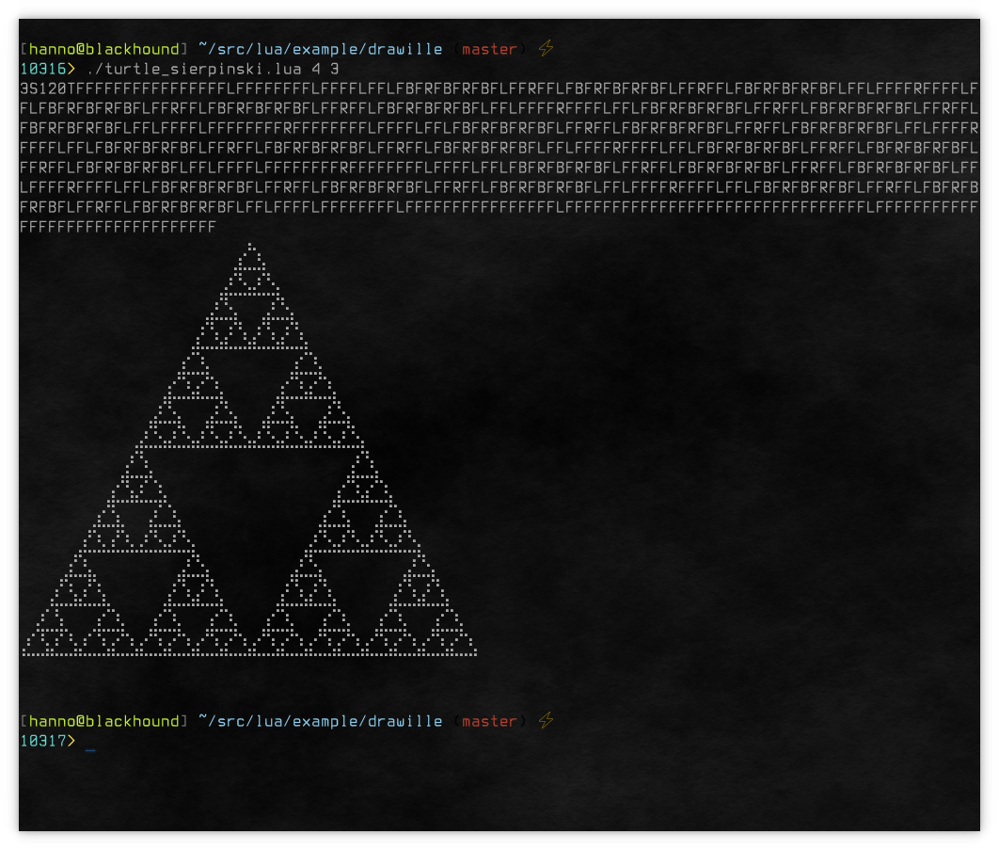
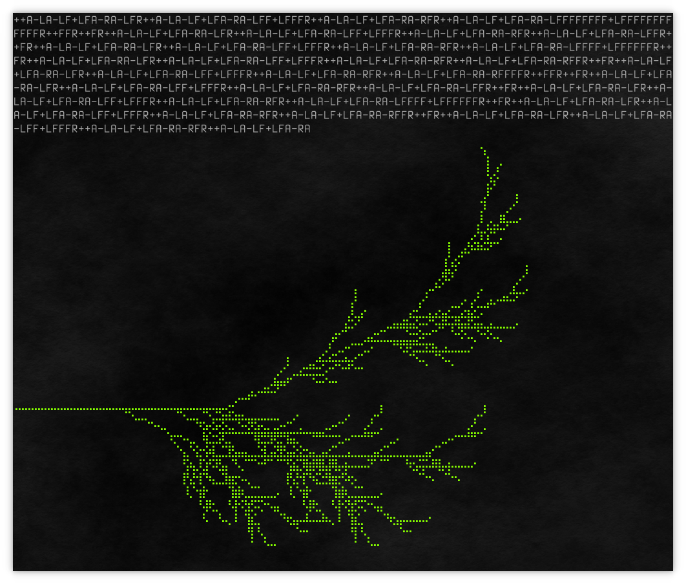
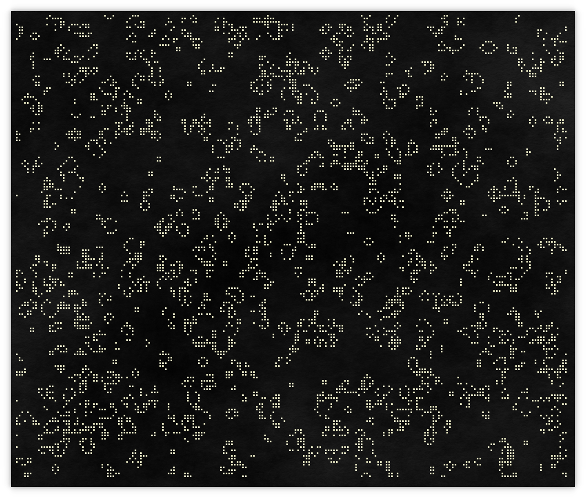
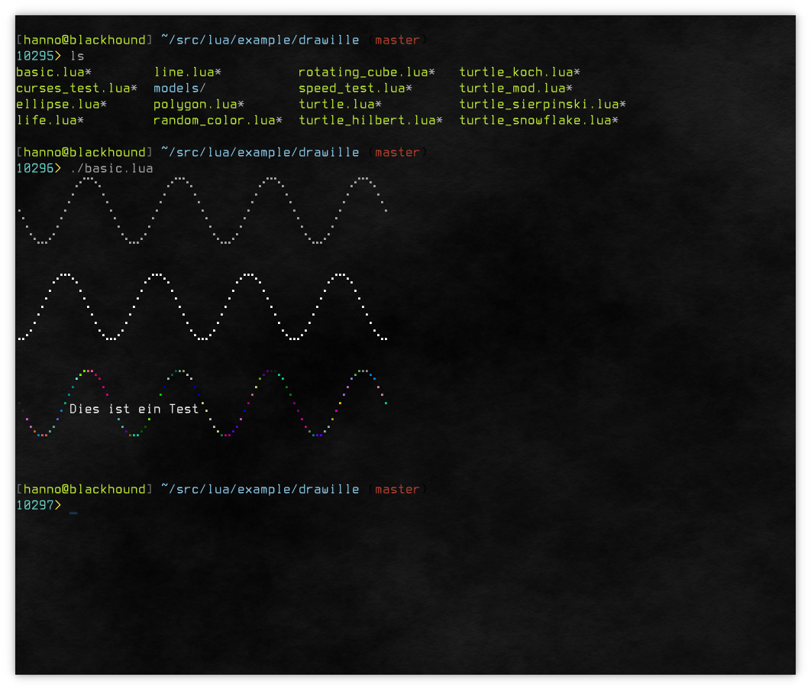

Lua-DRAWILLE
============

[](https://shields.io/)
[](https://shields.io/)
[](https://shields.io/)
[](https://shields.io/)

Draw graphics on the terminal with Braille charakters. Implements a small graphics kernel with a handfull of useful routines, like Line Bresenham and Ellipse, light 3D support and Turtle Graphics.

Additionally the PGL "Primitive Graphics Language", that will plot a graph from a string and that is supported by the implementation of a Lindenmayer algorithm to create fractals. Implementing a nice little Conway's Game of Life as an example.

Lua implementation of [drawille](http://github.com/asciimoo/drawille)
Version 2.0 of [drawille](https://github.com/silizium/lua-drawille.git)


### Usage

```lua
Canvas = require "drawille"

local c = Canvas.new()

for i=0,360*4 do
    if (i % 15) == 0 then
        c:set(i/15, math.floor(math.sin(i*(math.pi/180))*4))
    end
end

print(c:frame())
```












### Usage with Colors
Note: Color Resolution is peer Character, not per Subpixel of the [Braille][] characters.
[Braille]: http://en.wikipedia.org/wiki/Braille
For usage with Curses see Examples.

```lua
Canvas = require "drawille"

local c = Canvas.new()
c.esccodes = true
for i=0,360*4 do
    if (i % 15) == 0 then
        local r = math.random(0,255)
        local g = math.random(0,255)
        local b = math.random(0,255)
        c:set(i/15, math.floor(math.sin(i*(math.pi/180))*4),r,g,b)
    end
end

print(c:frame())
```


### Added features with 2.0

* point3D library with rudimentary backface culling
* full support of turtle graphics 
* lindenmayer algorithm
* new "drawille drawing language" DDL 
* shitload of additional examples, especially for Lindenmayer
* Conways "Game of Life"
* many new features
* better 3D routines, lines, ellipses (now Bresenham), working polygons
* more or less everything the Python version can do but more than that
* remaining basically compatible to 1.0

### Dependings

* lcurses (sudo luarocks install lcurses)

### ToDo

* better, full 3D routines, using of GPU if available, matrix routines
* replacing culling algorithm with more modern way, expanding 3D functionality
* implementing load of 3D objects (working on that right now)
* while everything is faster in this version, the "speed_test" is still slower than the Python version, because the data structure is different
* porting data structure into Lua FFI implementation, no optimization done yet

### Video Tutorials

* https://www.youtube.com/watch?v=aHqVpk_EPGA 3D Cube
* https://www.youtube.com/watch?v=IUMqfx5S-so Koch Snowflake
* https://www.youtube.com/watch?v=D3qCxwQXOns Game of Life
* https://www.youtube.com/watch?v=L9th_TFU3fw Lindenmayer
* https://www.youtube.com/watch?v=NaZ4_mBrXM4 Starfield

### Bugs

Bugs or suggestions? Visit the [issue tracker](https://github.com/silizium/lua-drawille/issues).

Tested with 
* `urxvt` terminal and `fixed` font 
* `Terminology` on Linux/Kubuntu 18.10 `Terminus (TTF)` Font
* `Terminator` on Linux/Kubuntu 18.10 

Not correctly showing on 
* `Konsole` with color activated, any font
* `Cool Retro Term` on Linux/Kubuntu 18.10

### LICENSE

```
drawille is free software: you can redistribute it and/or modify
it under the terms of the GNU Affero General Public License as published by
the Free Software Foundation, either version 3 of the License, or
(at your option) any later version.

drawille is distributed in the hope that it will be useful,
but WITHOUT ANY WARRANTY; without even the implied warranty of
MERCHANTABILITY or FITNESS FOR A PARTICULAR PURPOSE.  See the
GNU Affero General Public License for more details.

You should have received a copy of the GNU Affero General Public License
along with drawille. If not, see < http://www.gnu.org/licenses/ >.

(C) 2014- by Adam Tauber, <asciimoo@gmail.com>
(CC) 2018 by Hanno Behrens, <behrens[DOT]hanno[AT]gmail[DOT]com>
```
